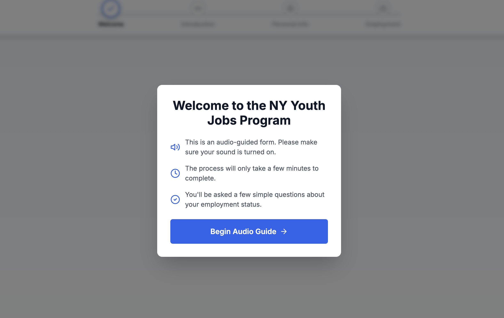

# Audio WOTC Unemployment Verification

> "I started this project on the 12 August and worked 25 hours a week and developed it on my own!!!"
> — **2024-09** | Auto WOTC Project Analysis | chatgpt

---

## The Problem

Tax credit applications have a $5,000 problem. Not $5,000 to build. **$5,000 per wrong answer.**

The industry standard was manual phone calls to verify unemployment status. 45 minutes each. $5K per applicant. And applicants who didn't understand the questions were clicking "No" on forms—not because they weren't eligible, but because they were confused.

Every wrong checkbox = lost revenue.

---

## The Insight

> "How about making it audio first for our questions to them and they respond clicking or typing."
> — **2024-12** | New York Youth Forum Eligibility | chatgpt

The bottleneck wasn't the form. It wasn't the code. It was **human comprehension**.

People weren't failing eligibility. They were failing to understand the question.

---

## The Solution

> "All I wanted to show you was how clever and simple that speech to text app is. Like just how absolutely easy it is to have voice instructions, simple big buttons, easy and quick, clear communication."
> — **2025-08** | Study my sparkii db in depth | chatgpt


*Audio-guided form with accessibility features*

Audio reads every instruction out loud. Simple Yes/No buttons—no confusing checkboxes. Progress stepper shows where they are. Mobile-friendly (most fill it out on phones). Under 60 seconds to complete.


*Collects basic info while audio reads instructions*

The key insight: **applicants weren't clicking "No" because they weren't eligible. They were clicking "No" because they didn't understand the question.**


*Employment Status — each wrong answer = $5,000 lost*

---

## The Result

| Metric | Before | After |
|--------|--------|-------|
| Cost per applicant | $5,000 (phone calls) | ~$0.10 |
| Time per verification | 45+ minutes | Under 60 seconds |
| Error rate | High (confusion) | Near zero (can't click wrong) |
| **Revenue generated** | — | **$200K+ (2024)** |

Built in **1 week**. Solo. No team. No funding.

---

## The Lesson

> "A production-ready, multi-tenant audio verification system built for a Tax Credit company."
> — **2025-10** | Untitled | claude-code

AI doesn't replace humans. It removes the friction points where humans fail. The same HR person who would misclick a checkbox can answer a simple question correctly when it's asked in plain language.

**The bottleneck isn't capability. It's interface. Fix the interface, unlock the capability.**

---

## Tech Stack

- **Next.js 14** — React framework with App Router
- **TypeScript** — Type safety throughout
- **Supabase** — Auth, storage, real-time, RLS
- **PostgreSQL** — Multi-tenant database
- **HTML5 Audio API** — Voice guidance
- **TanStack Table v8** — Data management
- **Tailwind CSS** — Styling

---

## Architecture

```
Audio Guidance → Simple Buttons → JSON Data → Validation → Supabase Storage
     ↓              ↓               ↓            ↓              ↓
  Reads aloud    Yes/No only    Structured    Zero errors    Multi-tenant
```

### Multi-Tenant Isolation

```sql
-- Row Level Security for complete tenant separation
CREATE POLICY tenant_isolation ON audio_files
  USING (tenant_id = current_setting('app.tenant_id')::uuid);
```

---

## Key Features

- **Audio-guided workflow** — Accessibility-first design
- **Multi-tenant data isolation** — Complete RLS-based separation
- **Real-time status updates** — Supabase subscriptions
- **Complete audit trail** — Every action logged
- **Queue-based processing** — Handle volume spikes

---

## The Pattern

This is part of a larger WOTC ecosystem I built:

| System | Purpose | Link |
|--------|---------|------|
| **Audio WOTC** | Voice-guided verification (this repo) | You're here |
| **Digital 8850** | Multi-language IRS form (7 languages) | [View →](https://github.com/mordechaipotash/digital_8850) |
| **Enterprise Platform** | Full pipeline: Gmail → AI → PostGIS → CSV | [View →](https://github.com/mordechaipotash/enterprise-tax-credit-platform) |

---

*Built in Beit Shemesh, Israel*

*$200K+ revenue generated in 2024. Built in 1 week. Solo.*
